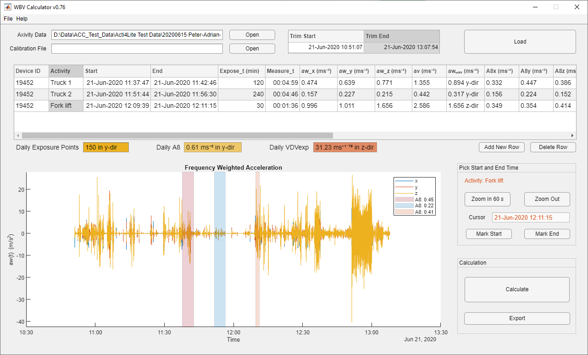

# WBV Calculator
Whole body vibration exposure calculation from Axivity accelerometers according to ISO 2631 standard. We can use this tool to measure whole body vibration exposure according to ISO 2631 standard using wearable accelerometers such as Axivity AX3. 

## Installation:
Download the tool from Github releases and double click the file **WBV_Calculator_SelfExtract_XXX** to extract the executable file to a folder of your choice. Then start the exeutable file **WBV_Calculator_XXX** to start the software.

## Presentations and demonstrations:
- [Application of low-cost accelerometers for measurement of whole body vibrations - NES 2022, Uppsala](Application_of_low-cost%20accelerometers_whole_body_vibrations.pdf)
- [WBV Calculator demonstration](WBV_Calculator_demo.mp4)

## Pilot study and validation
Information about a validation study regarding feasibility, and accuracy of the tool, see:
- [Helkroppsvibrationsmätningar med Axivity AX3 (swedish)](https://ammuppsala.se/wp-content/uploads/2021/05/rapport-nr-1-2021.pdf)

## Help and support
- WBV Calculator is no longer under active development. Consider it as a beta software and it is not recommended for critical tasks. See the license below for usage. You are encourage to use the source for your own projects if you adhere to LGPLV3 license (see below). Contact the [Pasan Hettiarachchi](mailto:pasan.hettiarachchi@medsci.uu.se?subject=[GitHub]%20WBV_Calculator) for more information.

## License and copyrights
- Source code is licensed under [LGPL v3](./LICENSE.md) and [3-Clause BSD License](https://opensource.org/license/bsd-3-clause/). License specified in individual source files are applicable.
- Compiled binary releases are licensed under the following binary release license.
### Binary release license
© 2022, Pasan Hettiarachchi,
Occupational and Environmental Medicine,
Uppsala University, Sweden

Not for commercial use. For redistribution please contact the author.

THE SOFTWARE IS PROVIDED "AS IS", WITHOUT WARRANTY OF ANY KIND, EXPRESS OR IMPLIED, INCLUDING BUT NOT LIMITED TO THE WARRANTIES OF MERCHANTABILITY, FITNESS FOR A PARTICULAR PURPOSE AND NONINFRINGEMENT. IN NO EVENT SHALL THE AUTHORS OR COPYRIGHT HOLDERS BE LIABLE FOR ANY CLAIM, DAMAGES OR OTHER LIABILITY, WHETHER IN AN ACTION OF CONTRACT, TORT OR OTHERWISE, ARISING FROM, OUT OF OR IN CONNECTION WITH THE SOFTWARE OR THE USE OR OTHER DEALINGS IN THE SOFTWARE.
